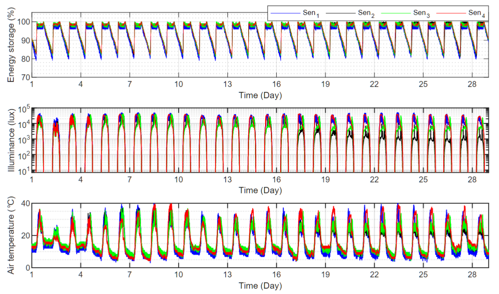

# LuXSensing Beacon: Batteryless IoT Sensor, Design Methodology and Field-test for Sustainable Greenhouse Monitoring

by
Kang Eun Jeon, Tsz Ngai Lin, James She, Simon Wong, Rajesh Govindan, Tareq Al-Ansari, and Bo Wang

This project is held in Qatar, with implementing luXSensing beacon in Greenhouse monitoring, jointly supported by Hamad Bin Khalifa University (HBKU) and Hong Kong University of Science and Technology (HKUST). luXsensing beacon is a proposed Internet-of-Thing (IoT) and energy-harvesting sensor for outdoor environment.
The design methodology and the related information about the field test are provided in the paper. Fig. 1 provides the measured sensory information in the field test, for 28 days, and it shows the reliability and sustainability of luXsensing beacon deployed in greenhouse. This paper has been submitted for publication in IEEE Transaction on AgriFood Electronics.

*Fig. 1: Accumulated measurements of (a)(top) energy storage, (a)(middle) illuminance, (a)(bottom) air temperature of the four luXSensing beacons for 28
days*

## Abstract

Greenhouse farming is a trending practice to secure food production in desert environments today. Such a practice often requires sensing systems to monitor the micro-climate of the greenhouse. However, traditional greenhouse monitoring systems are limited by their feature size, energy consumption, and maintenance cost. To address these issues, this paper introduces a luXSensing beacon -- an energy-harvesting sensing device empowered with Bluetooth communication technology to perform continuous sensing of environmental conditions. To enable long-lasting or even batteryless operation of the sensing device, we propose a novel and generic design methodology to suggest minimum energy harvesting hardware requirements, namely the photovoltaic panel’s area and supercapacitor’s capacitance for energy storage. Furthermore, a lifetime model is also proposed to calculate the extended lifetime of a hybrid energy harvesting device if it is equipped with a backup battery. Based on the proposed methodology, a prototype system is developed, deployed, and tested in a desert greenhouse in Qatar. The luXSensing beacon demonstrated its capability of monitoring air temperature and illuminance continuously in a 24/7 manner. The comparative compactness and low-energy consumption of the system are advantageous not only to its deployment in greenhouses but also to the reduction of energy budget and the maintenance cost of greenhouse farming.

## Software implementation

All source code used in this study is provided in `TAFE_luXSensing_beacon_main.ipynb` file.
The calculations and figure generation are all run by Python.
The data used in this study is provided in `data`.
Results generated by the code are saved in `results`.
See the `README.md` files in each directory for a full description.

## Getting the code

You can download a copy of all the files in this repository by cloning the
[git](https://git-scm.com/) repository:

    git clone https://github.com/sbeacon/luXSensing-Beacon.git

A copy of the repository is also archived at *insert DOI here*

## License

All source code is made available under a BSD 3-clause license. You can freely
use and modify the code, without warranty, so long as you provide attribution
to the authors. See `LICENSE.md` for the full license text.

The manuscript text is not open source. The authors reserve the rights to the
article content, which is currently submitted for publication in the
JOURNAL NAME.
